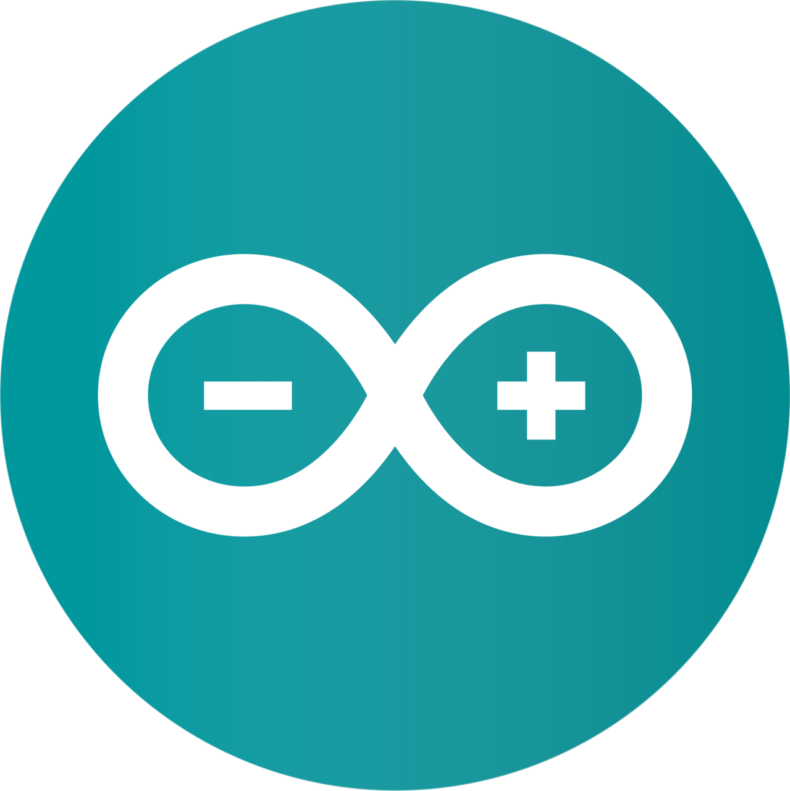

# __SETUP__

## Arduino 
> Use the following link to download `Arduino` [__Click here to download ARDUINO__](https://www.arduino.cc/en/software)



## ESP_32 Arduino preference json

#### click on file


### click on preferences


### click on Additional Boards Manager 


_And paste one the folling link_

> Stable release link: 
>> `https://espressif.github.io/arduino-esp32/package_esp32_index.json`

>Development release link:
>> `https://espressif.github.io/arduino-esp32/package_esp32_dev_index.json`


## __ESP 32 board setup__

> Drivers for __CP210x__
>> `https://www.silabs.com/developers/usb-to-uart-bridge-vcp-drivers?tab=downloads`

```
The CP210x USB to UART Bridge Virtual COM Port (VCP) drivers are required for device operation as a Virtual COM Port to facilitate host communication with CP210x products. These devices can also interface to a host using the direct access driver.
```

## __IRL-540 MoSFET__

Documentation :
`https://www.vishay.com/docs/91300/irl540.pdf`


__Typcial output characteristics__


## ESP_32 __`Arduino API`__ documentation 

```
https://docs.espressif.com/projects/arduino-esp32/en/latest/getting_started.html```
